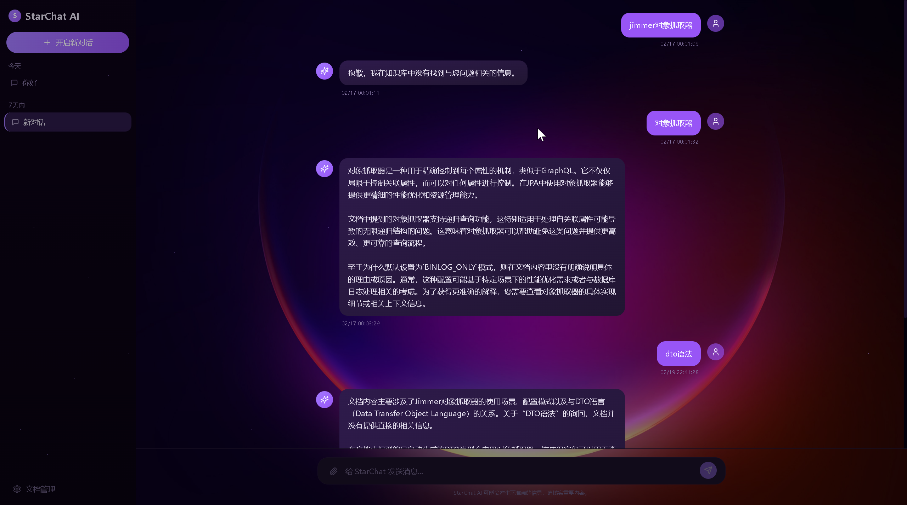
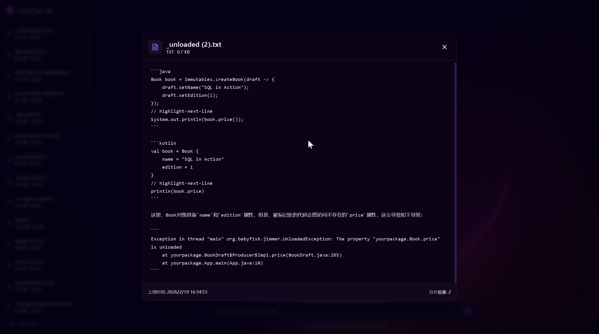

# Knowledge Base

基于 RAG（检索增强生成）的知识库系统，支持文档上传、智能问答和对话管理。

**前端项目地址**: https://github.com/KeXingJian/cosmic-chat

## 技术栈

- **后端**: Spring Boot 4.0.2 + Java 21
- **数据库**: PostgreSQL 16 + pgvector（向量存储）
- **缓存**: Redis 7
- **AI 服务**: Ollama（Qwen2:7b + Nomic Embed Text）
- **对象存储**: MinIO
- **前端**: React + Vite
- **反向代理**: Nginx

## 系统预览

### 预览图 1


### 预览图 2


## 快速开始

### 前置要求

- Docker
- Docker Compose

### 启动步骤

1. **克隆项目**
   ```bash
   git clone <repository-url>
   cd knowledge-base
   ```

2. **配置环境变量**
   
   项目已包含 `.env` 文件，默认配置如下：
   ```bash
   # Ollama 配置
   OLLAMA_EXPOSE_PORT=11434
   OLLAMA_BASE_URL=http://ollama:11434
   
   # 数据库配置
   DATABASE_EXPOSE_PORT=5432
   DATABASE_DB=kxj
   DATABASE_USER=postgres
   DATABASE_PASSWORD=postgres
   
   # Redis 配置
   REDIS_PASSWORD=redis
   REDIS_EXPOSE_PORT=6379
   
   # MinIO 配置
   MINIO_EXPOSE_PORT=9000
   MINIO_CONSOLE_PORT=9001
   MINIO_ACCESS_KEY=minioadmin
   MINIO_SECRET_KEY=minioadmin
   
   # Web 配置
   WEB_EXPOSE_PORT=8080
   
   # Nginx 配置
   NGINX_EXPOSE_PORT=80
   ```

3. **构建并启动所有服务**
   ```bash
   docker-compose up -d --build
   ```

4. **拉取 Ollama 模型**
   
   Ollama 容器启动后会自动拉取以下模型：
   - `nomic-embed-text`（文本嵌入模型）
   - `qwen2:7b`（对话模型）
   
   如果自动拉取失败，可以手动进入容器拉取：
   ```bash
   # 进入 ollama 容器
   docker exec -it rag-ollama sh
   
   # 拉取嵌入模型
   ollama pull nomic-embed-text
   
   # 拉取对话模型
   ollama pull qwen2:7b
   
   # 退出容器
   exit
   ```

5. **查看服务状态**
   ```bash
   docker-compose ps
   ```

## 访问地址

启动成功后，可以通过以下地址访问：

- **前端页面**: http://localhost
- **后端 API**: http://localhost/api
- **MinIO 控制台**: http://localhost:9001
  - 用户名: `minioadmin`
  - 密码: `minioadmin`
- **Ollama API**: http://localhost:11434

## 服务说明

| 服务名 | 容器名 | 端口 | 说明 |
|--------|--------|------|------|
| web | web | 8080 | Spring Boot 后端服务 |
| nginx | nginx | 80 | 前端静态文件 + API 反向代理 |
| postgres | rag-postgres | 5432 | PostgreSQL 数据库 |
| redis | redis | 6379 | Redis 缓存 |
| ollama | rag-ollama | 11434 | Ollama AI 服务 |
| minio | minio | 9000/9001 | MinIO 对象存储 |

## 常用命令

```bash
# 启动所有服务
docker-compose up -d

# 停止所有服务
docker-compose down

# 查看日志
docker-compose logs -f

# 查看特定服务日志
docker-compose logs -f web
docker-compose logs -f ollama

# 重启某个服务
docker-compose restart web

# 进入某个容器
docker exec -it web sh
docker exec -it rag-ollama sh
```

## 故障排查

### 1. Ollama 模型拉取失败

如果 Ollama 容器启动后无法自动拉取模型，请手动进入容器拉取：
```bash
docker exec -it rag-ollama sh
ollama pull nomic-embed-text
ollama pull qwen2:7b
```

### 2. 数据库连接失败

检查 PostgreSQL 容器是否健康：
```bash
docker-compose ps rag-postgres
```

### 3. Redis 连接失败

检查 Redis 容器是否在运行：
```bash
docker-compose ps redis
```

### 4. 前端无法访问

检查 Nginx 容器是否正常运行：
```bash
docker-compose ps nginx
```

## 项目结构

```
knowledge-base/
├── src/main/java/com/kxj/knowledgebase/  # Java 源代码
│   ├── config/                            # 配置类
│   ├── controller/                        # 控制器
│   ├── service/                           # 服务层
│   ├── repository/                        # 数据访问层
│   └── entity/                            # 实体类
├── ui/                                    # React 打包文件
├── Dockerfile                             # 后端 Docker 镜像构建文件
├── compose.yaml                           # Docker Compose 配置
├── nginx.conf                             # Nginx 配置
└── .env                                   # 环境变量配置
```
